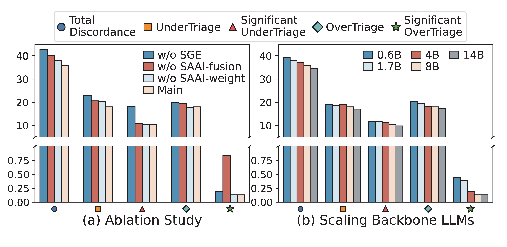

## 🛠️ Fine-Tuning Results

# Human Expert Evaluation
## ⚖️ Evaluation of Clinical Quality and Plausibility

Human expert evaluation of constructed triage notes from MIMIC-IV and NHAMCS, compared with real-world ED clinical notes (Reference), across five quality dimensions. Scores are linearly rescaled from a 1-5 Likert scale to a 0-100 range.

## 👨‍⚖️  Evaluation of Hallucination Assessment

Human expert assessment of field-level faithfulness for triage notes generated by the CNA module on MIMIC-IV and NHAMCS. Scores are rescaled from a 1-10 scale to a 0-100 range.
