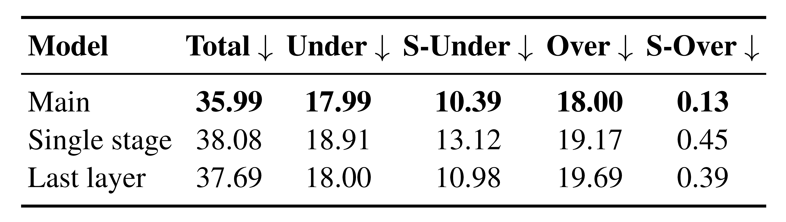
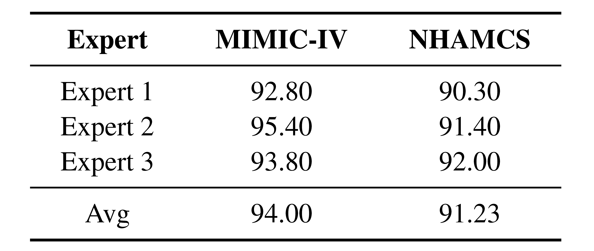

# Supplementary Experiments and Human Evaluation
## 📊 Ablation study and backbone LLMs

Ablation study and performance comparison across backbone LLMs of different scales. Lower values indicate better performance.

## ✨ Influence of Different Architectura Settings

Performance comparison (%) of three variants under the Qwen3-8B setting across five triage metrics. We report Total Discordance, UnderTriage, and OverTriage rates, as well as their clinically significant counterparts (S-Under and S-Over). Lower values indicate better performance.

# Human Expert Evaluation
## ⚖️ Evaluation of Clinical Quality and Plausibility

Human expert evaluation of constructed triage notes from MIMIC-IV and NHAMCS, compared with real-world ED clinical notes (Reference), across five quality dimensions. Scores are linearly rescaled from a 1-5 Likert scale to a 0-100 range.

## 👨‍⚖️  Evaluation of Hallucination Assessment

Human expert assessment of field-level faithfulness for triage notes generated by the CNA module on MIMIC-IV and NHAMCS. Scores are rescaled from a 1-10 scale to a 0-100 range.
